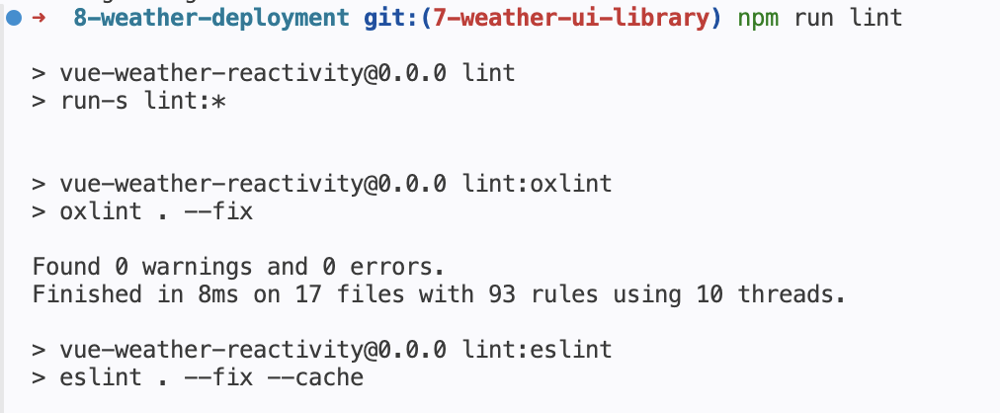
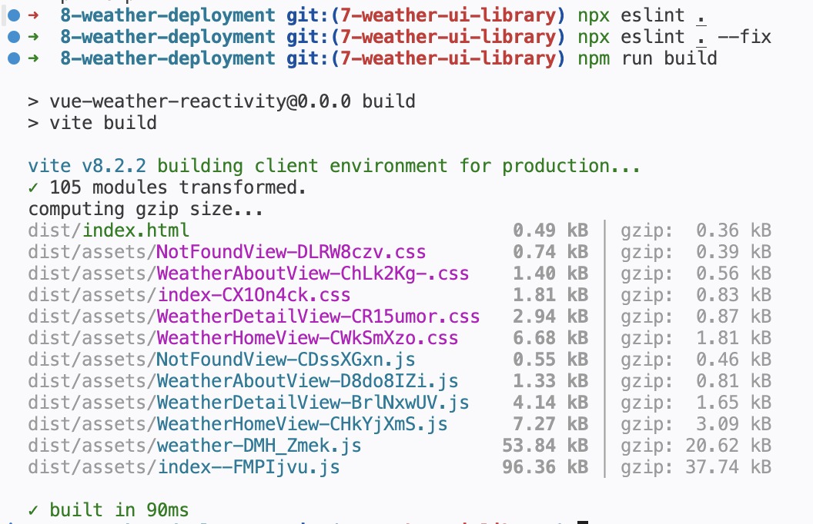
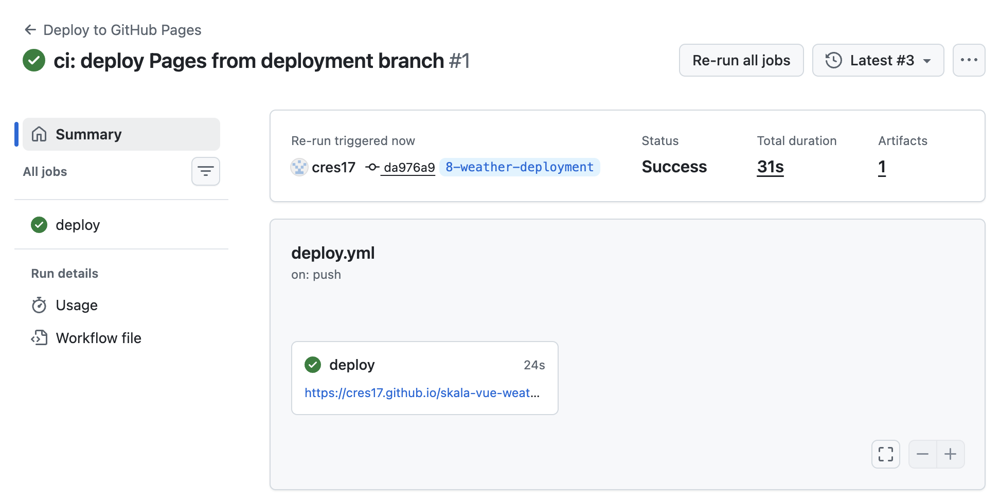
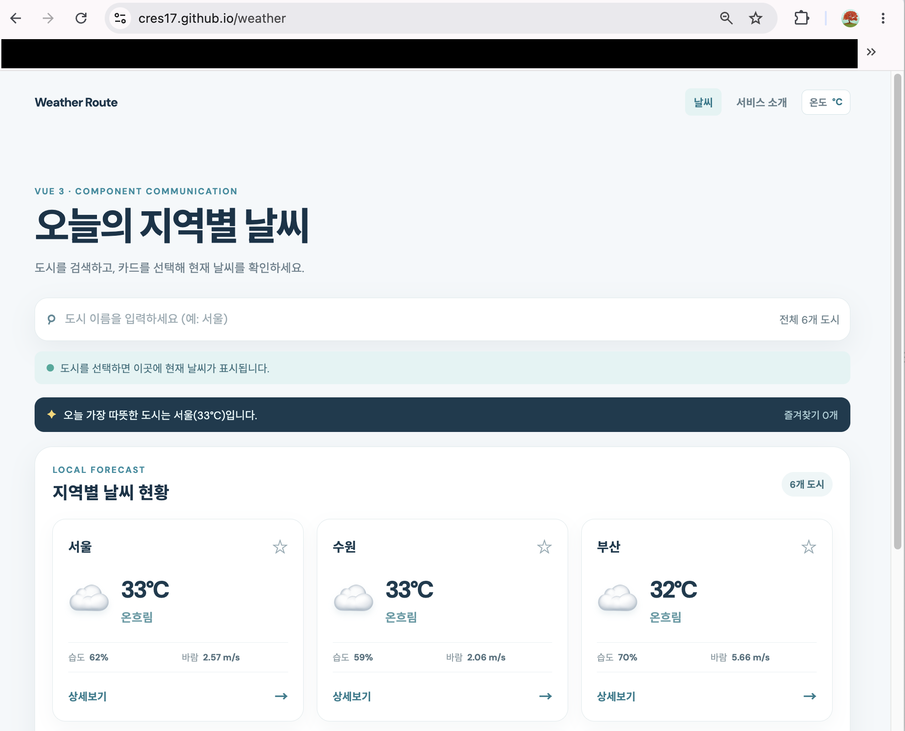

# Weather Deployment

## Source Code 품질관리

### 1. ESLint 점검

제출 전 ESLint와 Oxlint로 소스 코드를 점검해 오류가 없도록 관리했습니다.

```bash
npm run lint
```

`lint` 명령은 ESLint와 Oxlint를 실행하며, 자동 수정 가능한 항목도 함께 정리합니다.





### 2. API 키 환경 변수 관리

API 키는 `.env` 환경 변수로 관리하고, 실제 키가 담긴 파일은 Git에 업로드하지 않습니다. `.gitignore`에서 `.env`와 `.env.*`를 제외하고, 키 이름만 담긴 `.env.example` 파일만 공유합니다.

```dotenv
VITE_OPENWEATHER_API_KEY=your_openweather_api_key
VITE_KMA_AUTH_KEY=your_kma_auth_key
```

## Build & Deployment

### 1. 프로젝트 Build

아래 명령으로 프로덕션용 정적 파일을 생성합니다.

```bash
npm run build
```

빌드가 완료되면 `dist/` 폴더에 정적 파일이 생성됩니다.



### 2. GitHub Pages 배포 및 확인

GitHub Pages는 정적 파일을 호스팅하는 서비스입니다. GitHub Actions가 `main` 또는 `8-weather-deployment` 브랜치에 푸시될 때마다 프로젝트를 빌드하고 `dist/` 폴더를 GitHub Pages에 배포합니다.

1. GitHub 저장소의 **Settings → Pages → Build and deployment**에서 Source를 **GitHub Actions**로 선택합니다.
2. **Settings → Secrets and variables → Actions**에서 `VITE_OPENWEATHER_API_KEY`를 Repository secret으로 등록합니다.
3. 변경 사항을 `8-weather-deployment` 브랜치로 푸시합니다.

   ```bash
   git add README.md vite.config.js .github/workflows/deploy.yml
   git commit -m "ci: deploy to GitHub Pages"
   git push origin 8-weather-deployment
   ```

4. GitHub 저장소의 **Actions** 탭에서 배포 workflow가 성공한 것을 확인합니다.
5. 배포 주소에서 서비스가 정상적으로 열리는지 확인합니다.

   `https://cres17.github.io/skala-vue-weather/`


